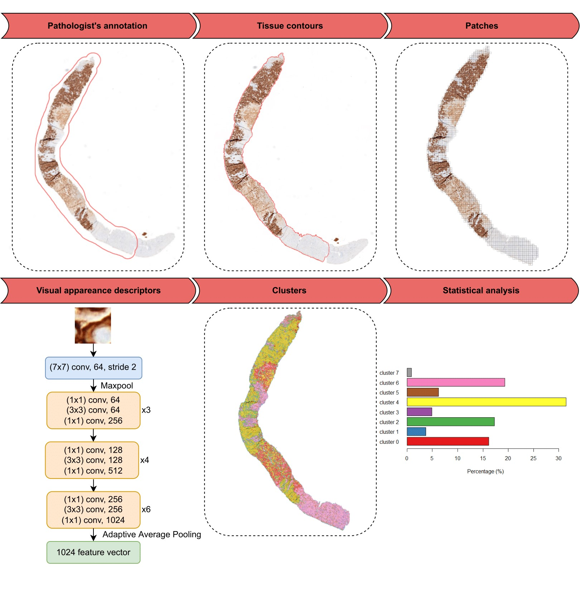

# Mechanism of action and resistance to Trastuzumab Deruxtecan within the DAISY trail: machine learning analysis



Code used to carry on the machine learning analyses to study HER2 spatial distribution on baseline biopsy samples
from the DAISY clinical trial.

## Installation

To reproduce the analyses, please first start by indicating the correct paths in ```./clustering_analysis/imports.py``` for:
* ```SLIDE_PATH``` pointing towards whole slide images save location.
* ```ROIS_PATH``` pointing towards csv file with ROI coordinates of areas to analyse in the slides.
* ```PATHOLOGIST_ANNOTATIONS_PATH``` pointing towards pathologist's annotations.

The packages needed to run the code are provided in ```environment.yml```. The environment can be recreated using:

```conda env create -f environment.yml```

## Pre-processing

The slides are first pre-processed using ```./create_patches_fp.py``` with the following command line:

```
python ./create_patches_fp.py path/to/slides path/to/ROIs --pathologist_annotations path/to/pathologist/annotations --seg --patch --stitch
```

Once the patches extracted, the ResNet features are computed using ```./extract_features_fp.py``` with
the following command line:

```
python ./extract_features_fp.py --data_h5_dir ./Results --data_slide_dir path/to/slides --csv_path ./dataset.csv --feat_dir ./Results/feats --batch_size 512 --slide_ext .mrxs
```

## Clustering analyses

Before performing clustering analyses, the extracted features must be concatenated in a matrix using ```./compute_features_matrix``` with the following command line:

```
python ./compute_features_matrix.py dataset.csv
```

Finally, the percentage of each cluster for each slide after training a Mini-Batch KMeans model on this feature matrix are retrieved using
```./compute_cluster_percentages.py``` with the following command line:

```
python ./compute_cluster_percentages.py ./Results/features_matrix.pickle dataset.csv
```

Optionally, the optimal number of clusters can be computed using ```./optimal_number_clusters``` with the produced ```features matrix```.
Several options are available to changer the range of clusters to consider or score to use.

To reproduce the figures, please use the R script ```./construct_figures_results.R```, and the jupyter file ```visualize.ipynb```.

For convenience, we have provided the resulting csv files of ```compute_cluster_percentages.py``` and ```optimal_number_clusters.py```. 
Please feel free to contact us to get access to slide files, pathologist's annotations, and ROIs and dataset csv files.

## Acknowledgement

Many thanks to Lu et al. for providing the implementation of their whole slide images pre-processing on which this code is based on -
see [here](https://github.com/mahmoodlab/CLAM) for more details.

## Reference


## Contact

Please feel free to contact us at :

loic.le-bescond@gustaveroussy.fr

## License

This code is MIT licensed, as found in the LICENSE file.